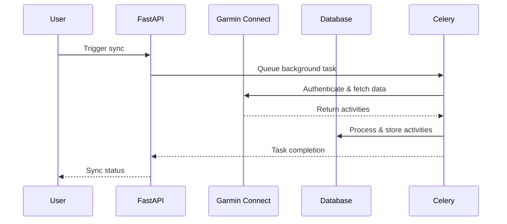

# CLAUDE.md - Technical Architecture Documentation

This document provides comprehensive technical details for developers working with or extending the Garmin Explorer project.

## 🏗️ System Architecture

### High-Level Overview

```
┌─────────────────┐    ┌─────────────────┐    ┌─────────────────┐
│                 │    │                 │    │                 │
│  Web Dashboard  │────│  FastAPI App    │────│   Database      │
│  (dashboard.html│    │  (main.py)      │    │  (SQLite/PG)    │
│                 │    │                 │    │                 │
└─────────────────┘    └─────────────────┘    └─────────────────┘
                                │
                                │
                       ┌─────────────────┐    ┌─────────────────┐
                       │                 │    │                 │
                       │  Garmin API     │────│  Background     │
                       │  Integration    │    │  Tasks (Celery) │
                       │                 │    │                 │
                       └─────────────────┘    └─────────────────┘
```

### Technology Stack

- **Backend**: FastAPI 0.104+ with Python 3.11+
- **Database**: SQLAlchemy 2.0 with SQLite (dev) / PostgreSQL (prod)
- **Task Queue**: Celery with Redis
- **Package Management**: uv (modern pip replacement)
- **Authentication**: JWT with python-jose
- **API Integration**: garminconnect library
- **Frontend**: Vanilla JavaScript with modern CSS
- **Deployment**: Docker with docker-compose

## 📂 Detailed Project Structure

```
garmin-explorer/
├── app/
│   ├── __init__.py
│   ├── celery_app.py           # Celery configuration
│   ├── tasks.py                # Background task definitions
│   ├── api/
│   │   └── v1/
│   │       └── endpoints/
│   │           ├── activities.py      # Activity CRUD operations
│   │           ├── auth.py           # Authentication endpoints
│   │           ├── dashboard.py      # Dashboard data endpoints
│   │           ├── digest.py         # Digest generation
│   │           ├── users.py          # User management
│   │           └── whatsapp_digest.py # WhatsApp integration
│   ├── core/
│   │   ├── config.py           # Pydantic settings management
│   │   ├── database.py         # SQLAlchemy setup
│   │   ├── deps.py             # Dependency injection
│   │   ├── encryption.py       # Credential encryption
│   │   └── security.py         # JWT and password handling
│   ├── models/
│   │   ├── activity.py         # Activity data model
│   │   ├── digest.py           # Weekly digest model
│   │   ├── group.py            # User group model
│   │   └── user.py             # User account model
│   └── services/
│       ├── garmin_service.py   # Garmin Connect integration
│       └── digest_service.py   # WhatsApp digest logic
├── scripts/
│   ├── generate_realistic_data.py  # Create test data
│   ├── seed_test_data.py          # Database seeding
│   ├── update_real_users.py       # User management
│   └── tests/                     # Testing scripts
├── static/
│   └── dashboard.html             # Single-page dashboard app
├── main.py                        # FastAPI app entry point
├── setup_system.py                # Database initialization
├── pyproject.toml                 # uv package configuration
└── uv.lock                        # Locked dependency versions
```

## 🔧 Core Components Deep Dive

### 1. Database Models (`app/models/`)

#### User Model (`user.py`)
```python
class User(Base):
    __tablename__ = "users"
    
    id: Mapped[UUID] = mapped_column(primary_key=True)
    email: Mapped[str] = mapped_column(unique=True, index=True)
    full_name: Mapped[str]
    garmin_email: Mapped[Optional[str]]  # Encrypted Garmin credentials
    garmin_password: Mapped[Optional[str]]  # Encrypted
    is_active: Mapped[bool] = mapped_column(default=True)
    preferences: Mapped[Optional[dict]] = mapped_column(JSON)
    last_sync_at: Mapped[Optional[datetime]]
    
    # Relationships
    activities: Mapped[List["Activity"]] = relationship(back_populates="user")
```

#### Activity Model (`activity.py`)
```python
class Activity(Base):
    __tablename__ = "activities"
    
    id: Mapped[UUID] = mapped_column(primary_key=True)
    user_id: Mapped[UUID] = mapped_column(ForeignKey("users.id"))
    garmin_activity_id: Mapped[str] = mapped_column(index=True)
    activity_type: Mapped[str]  # running, cycling, swimming, etc.
    activity_name: Mapped[Optional[str]]
    start_time: Mapped[datetime] = mapped_column(index=True)
    duration: Mapped[Optional[int]]  # seconds
    distance: Mapped[Optional[float]]  # meters
    calories: Mapped[Optional[int]]
    avg_heart_rate: Mapped[Optional[int]]
    max_heart_rate: Mapped[Optional[int]]
    elevation_gain: Mapped[Optional[float]]
    raw_data: Mapped[Optional[dict]] = mapped_column(JSON)
    processed_metrics: Mapped[Optional[dict]] = mapped_column(JSON)
    
    # Relationships
    user: Mapped["User"] = relationship(back_populates="activities")
    
    @property
    def distance_km(self) -> float:
        return self.distance / 1000 if self.distance else 0.0
```

### 2. API Endpoints (`app/api/v1/endpoints/`)

#### Dashboard API (`dashboard.py`)

The dashboard endpoint provides comprehensive weekly analytics:

```python
@router.get("/weekly", response_model=WeeklyDashboard)
async def get_weekly_dashboard(
    week_offset: int = Query(0, description="Weeks back from current week"),
    db: Session = Depends(get_db)
):
    # Calculates:
    # - User weekly stats (steps, distance, calories, activities)
    # - Year-to-date comparisons
    # - Monthly averages and trends
    # - Previous week comparisons
```

**Response Structure:**
```json
{
  "week_start": "2025-09-01T00:00:00",
  "week_end": "2025-09-08T00:00:00", 
  "week_number": 36,
  "year": 2025,
  "users": [
    {
      "name": "Jeff",
      "total_steps": 35055,
      "running_distance_km": 25.73,
      "active_calories": 1886,
      "total_activities": 3,
      "ytd_total_steps": 1165460,
      "ytd_running_distance_km": 780.99,
      "ytd_active_calories": 130318,
      "ytd_total_activities": 169
    }
  ],
  "totals": {...},
  "previous_week_comparison": {...},
  "monthly_comparison": {...},
  "year_to_date_comparison": {...}
}
```

### 3. Garmin Integration (`app/services/garmin_service.py`)

```python
class GarminService:
    def __init__(self, db: Session):
        self.db = db
    
    async def sync_user_activities(self, user: User) -> List[Activity]:
        """Sync activities from Garmin Connect API"""
        # 1. Decrypt user credentials
        # 2. Authenticate with Garmin
        # 3. Fetch recent activities
        # 4. Process and store in database
        # 5. Return list of new activities
        
    async def get_activities_by_date(self, user: User, start_date: datetime, end_date: datetime):
        """Fetch activities for specific date range"""
```

### 4. Background Tasks (`app/tasks.py`)

Celery tasks for asynchronous operations:

```python
@celery_app.task
def sync_all_users():
    """Sync activities for all active users"""
    # Scheduled task - runs every hour
    
@celery_app.task  
def generate_weekly_digest(group_id: str):
    """Generate and send weekly WhatsApp digest"""
    # Scheduled task - runs Sunday nights
    
@celery_app.task
def sync_user_activities_background(user_id: str):
    """Background sync for individual user"""
```

### 5. Frontend Dashboard (`static/dashboard.html`)

Single-page application with modern JavaScript:

```javascript
class Dashboard {
    constructor() {
        this.API_BASE = '/api/v1';
        this.dashboardData = null;
        this.init();
    }
    
    async loadDashboardData() {
        // Parallel loading of dashboard and digest data
        const [weeklyResponse, digestResponse] = await Promise.all([
            fetch(`${this.API_BASE}/dashboard/weekly`),
            fetch(`${this.API_BASE}/dashboard/digest/latest`)
        ]);
        
        // Render components
        this.renderUserStats();
        this.renderMonthlyStats(); 
        this.renderWeeklyDigest();
        this.renderMemberComparison();
    }
}
```

## 🔄 Data Flow & Processing

### 1. Activity Sync Process



### 2. Dashboard Data Pipeline

1. **Raw Data Collection**: Activities stored with complete Garmin payload
2. **Metrics Processing**: Extract steps, calories, distance, heart rate
3. **Aggregation**: Calculate weekly, monthly, YTD totals
4. **Comparison Logic**: Generate trends vs. previous periods
5. **API Response**: Structured JSON for frontend consumption

### 3. Digest Generation

```python
def generate_digest(users: List[User], week_start: datetime) -> WeeklyDigest:
    # 1. Aggregate group activities for the week
    # 2. Calculate leaderboards (most active, most steps, longest distance)
    # 3. Identify achievements and milestones
    # 4. Format as WhatsApp-friendly message
    # 5. Store digest for sharing
```

## 🛠️ Development Workflows

### Adding New Activity Types

1. **Update Activity Model**: Add new activity type constants
2. **Extend Garmin Service**: Handle new activity-specific data
3. **Update Dashboard Logic**: Add visualization for new metrics
4. **Test Data Generation**: Include new activity types in test data

### Creating New API Endpoints

```python
# 1. Define Pydantic models
class NewFeatureRequest(BaseModel):
    field: str
    
class NewFeatureResponse(BaseModel):
    result: str

# 2. Create endpoint
@router.post("/new-feature", response_model=NewFeatureResponse)
async def create_new_feature(
    request: NewFeatureRequest,
    db: Session = Depends(get_db),
    current_user: User = Depends(get_current_user)
):
    # Implementation
    return NewFeatureResponse(result="success")

# 3. Update frontend to consume endpoint
```

### Database Migrations

```bash
# Create migration after model changes
uv run alembic revision --autogenerate -m "Add new feature"

# Review generated migration in alembic/versions/
# Apply migration
uv run alembic upgrade head
```

### Testing Strategy

```python
# Unit tests for services
def test_garmin_service_authentication():
    service = GarminService(db_session)
    result = service.authenticate_user(test_user)
    assert result.success

# Integration tests for API endpoints  
def test_dashboard_weekly_endpoint():
    response = client.get("/api/v1/dashboard/weekly")
    assert response.status_code == 200
    assert "users" in response.json()

# End-to-end tests for critical workflows
def test_complete_sync_workflow():
    # Test full sync from Garmin API to dashboard display
```

## 🔐 Security Considerations

### Credential Management
- Garmin passwords encrypted using Fernet symmetric encryption
- Encryption key stored in environment variables
- Never log or expose decrypted credentials

### API Security
- JWT tokens for authentication
- Rate limiting on sensitive endpoints
- Input validation with Pydantic models
- SQL injection prevention via SQLAlchemy ORM

### Data Privacy
- User consent for Garmin data access
- Anonymized analytics and logging
- Secure deletion of user data on request

## 🚀 Deployment & Operations

### Production Configuration

```bash
# Environment variables for production
DATABASE_URL=postgresql://user:pass@db:5432/garmin_explorer
REDIS_URL=redis://redis:6379/0
SECRET_KEY=production-secret-key-32-chars-min
GARMIN_ENCRYPTION_KEY=fernet-key-for-credential-encryption

# Docker compose production
docker-compose -f docker-compose.prod.yml up -d
```

### Monitoring & Logging

```python
# Structured logging configuration
import structlog

logger = structlog.get_logger()
logger.info("User sync completed", user_id=user.id, activities_count=count)
```

### Health Checks

```python
@router.get("/health")
async def health_check(db: Session = Depends(get_db)):
    # Check database connectivity
    # Check Redis connectivity  
    # Check Garmin API availability
    return {"status": "healthy", "timestamp": datetime.utcnow()}
```

## 📊 Performance Optimization

### Database Optimization
- Indexes on frequently queried fields (user_id, start_time, activity_type)
- Connection pooling with SQLAlchemy
- Query optimization for dashboard aggregations
- Periodic cleanup of old activity data

### API Performance
- Response caching for dashboard data (30-second TTL)
- Pagination for large result sets
- Async processing for Garmin API calls
- Background task queuing for non-critical operations

### Frontend Optimization
- Minimal JavaScript bundle (no frameworks)
- Efficient DOM updates with modern JavaScript
- Progressive loading of dashboard sections
- Responsive design with CSS Grid

## 🔮 Extension Points

### WhatsApp Integration
- Custom message templates
- Multiple chat group support
- Rich media sharing (charts, images)
- Interactive digest responses

### Advanced Analytics
- Machine learning for activity predictions
- Trend analysis and goal recommendations
- Comparative analysis with fitness community
- Integration with other fitness platforms

### Multi-Platform Support
- Mobile app development (React Native)
- Apple Watch complications
- Garmin Connect IQ app
- Strava integration

## 📝 Code Style & Conventions

### Python Code Style
- Black formatting with 88-character line limit
- isort for import organization
- Type hints for all function signatures
- Docstrings for public methods and classes

### API Design
- RESTful endpoint naming
- Consistent error response format
- Comprehensive API documentation with examples
- Versioned APIs (v1, v2) for backward compatibility

### Database Conventions
- Snake_case for column names
- UUIDs for primary keys
- Soft deletes with `deleted_at` columns
- Audit trails for sensitive data changes

## 🤝 Contributing Guidelines

### Development Setup
1. Fork repository and create feature branch
2. Install dependencies: `uv sync`
3. Run tests: `uv run pytest`
4. Check code style: `uv run black . && uv run isort .`

### Pull Request Process
1. Feature branch from `main`
2. Comprehensive test coverage
3. Updated documentation
4. Code review approval
5. Squash and merge

### Release Process
1. Version bump in `pyproject.toml`
2. Update CHANGELOG.md
3. Create release tag
4. Automated deployment via CI/CD

---

This technical documentation provides the foundation for understanding, maintaining, and extending the Garmin Explorer project. For user-facing documentation, see [README.md](README.md).